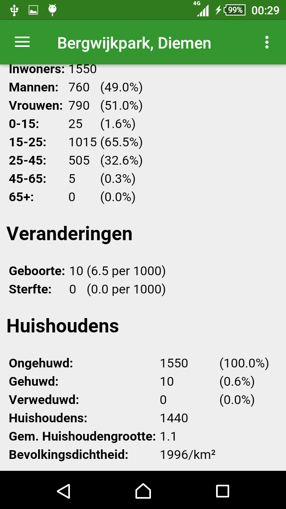
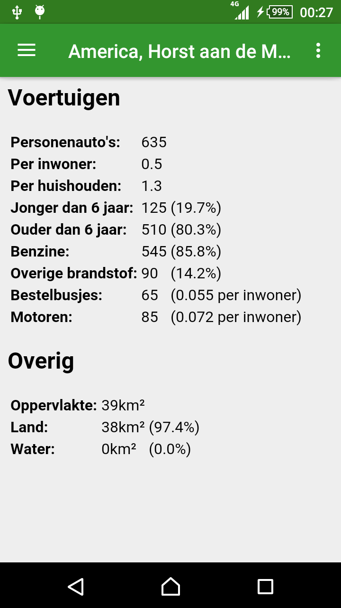
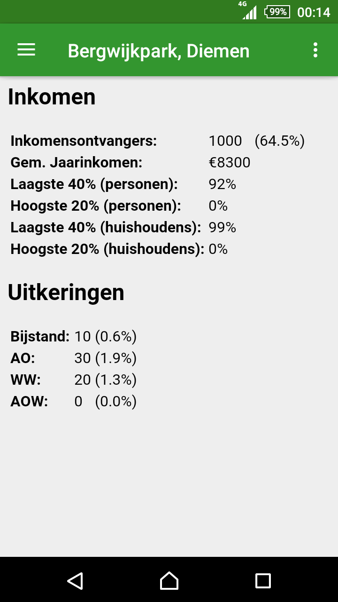
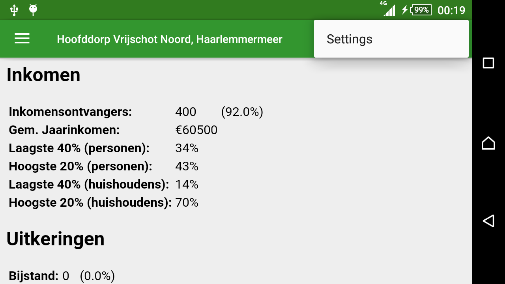
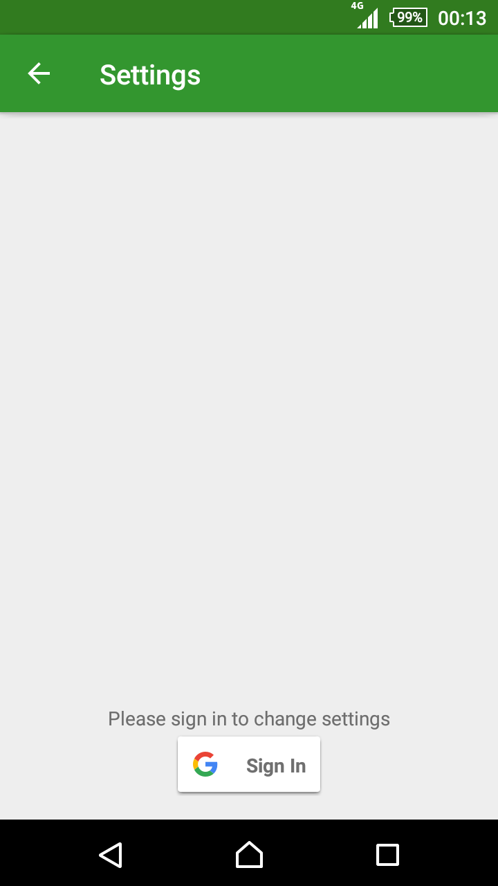
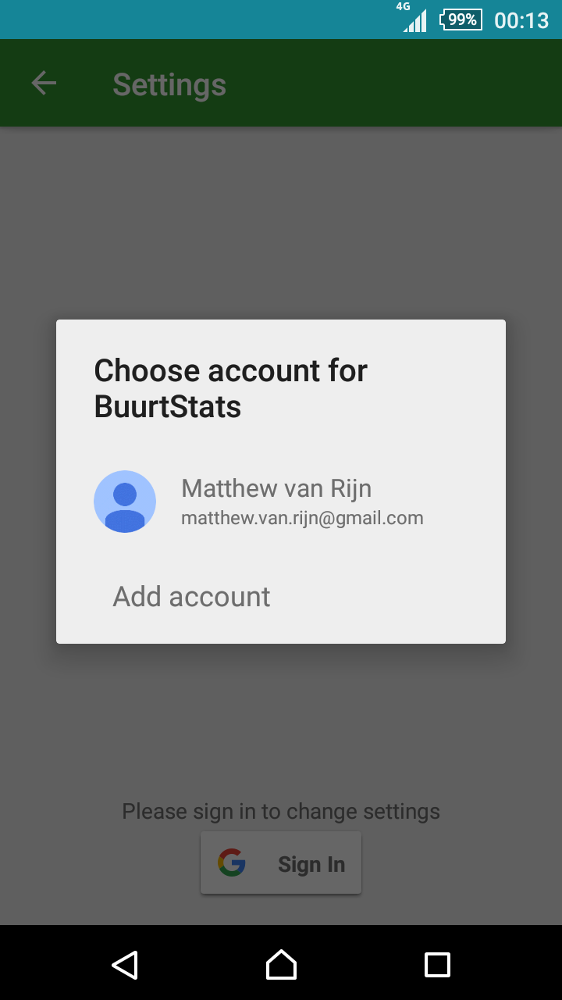
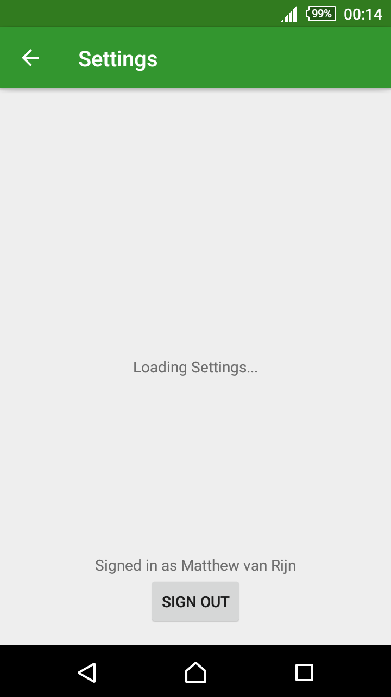
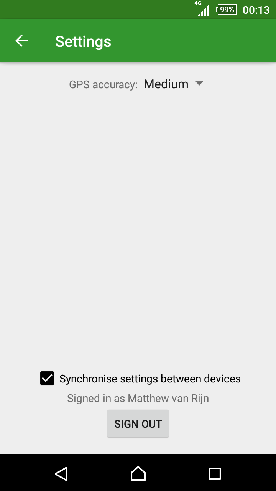

# Native App Studio: Build Your Own!
By Matthew van Rijn (10779353)

This app shows statistics about the neighbourhood in which the user is located.

## Activities
There are two activities, one for showing stats and one for changing settings. The stats activity implements a drawer which allows the user to switch between fragments showing different kinds of statistics. The settings activity allows the user to change the app settings, which are saved to Firebase.

### Stats (Main)
In this activity you can view four categories of statistics. To switch between categories, either swipe the drawer in from the left or press the drawer button in the top left corner. To access the settings, press the menu button and select "settings". The activity supports rotation, but has no special layout for landscape mode.

#### Screenshots
<table>
	<tr>
		<td></td>
		<td></td>
		<td></td>
		<td></td>
	</tr>
</table>

### Settings
This activity allow you to change your settings. Currently there are two settings available: GPS accuracy ans whether to synchronise your settings. When setting synchronisation is on the GPS accuracy is stored in the Firebase real-time database. To access the setting you need to sign in with google. To go back to the stats, press either the back or up button.

#### Screenshots
<table>
	<tr>
		<td></td>
		<td></td>
		<td></td>
		<td></td>		
	</tr>
</table>

### APIs
The app in centered around the CBS open data API, which provides access to many statistical datasets. For this app I chose to use the "Kernwaarden Wijken en Buurten" dataset. An example of the API response for this dataset can be viewed [here](http://opendata.cbs.nl/ODataApi/odata/83487NED/TypedDataSet?$filter=WijkenEnBuurten%20eq%20%27BU06130309%27). 

To query the CBS API I needed to know in which statistical area, in this case "Buurt" the user is located. The CBS provides a shapefile of its "Buurten" [here](https://www.cbs.nl/nl-nl/dossier/nederland-regionaal/geografische%20data/wijk-en-buurtkaart-2016). I converted this to a [Spatialite](https://www.gaia-gis.it/gaia-sins/) database qhich can be queried using converted WSG84 (GPS) coordinates. The database is about 80mb, so it is not practical to package it with the app. Instead I exposed the database using my own API, the output of which can ve viewed [here](https://www.mjvrijn.nl/api/buurt.php?lat=52.355&lon=4.955).

### Issues
- Data is collected from 2014-2016, but the population is from 2016. This can result in percentages not adding to 100%.
- Neighbourhoods and municipalities can have very long names, which don't fit in the title bar.

### Requirements
This app meets all of the assignment requirements as detailed below.

**The app concept should be centered around a live open data API.**
The app is centered around the open data API of the CBS (Statistics Netherlands) at opendata.cbs.nl.

**External data should be retrieved using HTTP-requests.**
HTTP requests are used to locate the neighbourhood the user is located in and the statistics of that neighbourhood.

**Some user data should be persisted on the phone (favorites, etc.).**
The neighbourhood stats are persisted on the phone, as well as all data needed to restore the application state.

**Firebase should be used to save user data.**
Firbase is used to save and synchronise the user's settings between all their devices.

**Even if killed, the app should generally resume in the same state as before.**
The app stores the previously selected page of stats and restores it if the app is restarted, as well as restorring the stats.

**Code should be organized well (keeping in mind a separation of concerns).**
This is subjective, but I certainly did my best.

**Code should be documented well (comments as well as READMEs).**
This is subjective, but I certainly did my best.

