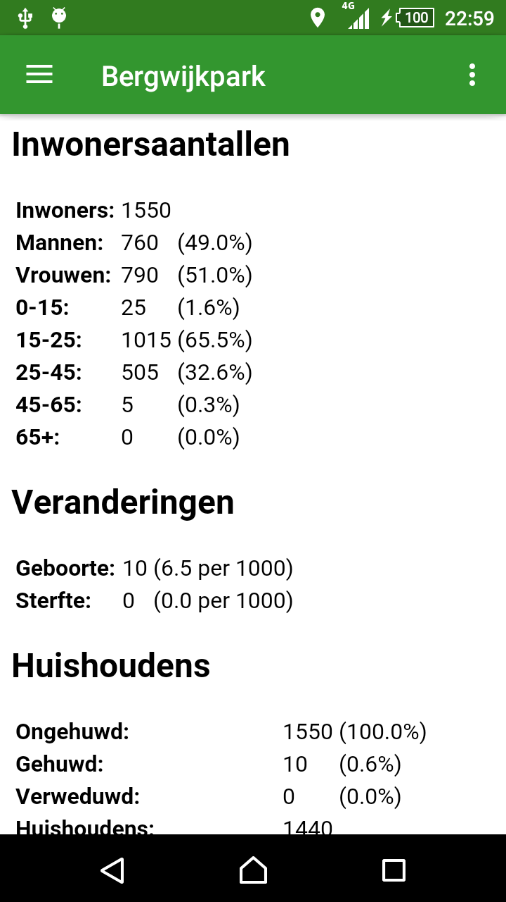

# Native App Studio: Buurst Stats
By Matthew van Rijn (10779353)

This app shows statistics about the neighbourhood in which the user is situated.

### Activities
There are two activities, one for showing stats and one for changing settings. The stats activity implements a drawer which allows the user to switch between fragments showing different kinds of statistics. The settings activity allows the user to change the app settings, which are saved on firebase.

### Done
- App layout and navigation
- Location lookup
- Neighbourhood geocoding
- Api requests
- Json parsing (not for all stats yet)
- Stat display (not for all stats yet)
- Google login/Firebase connection
- State restoration

### Not Done
- Settings saved to Firebase
- Json parsing / stat display (for some stats)
- Progress updates

### Issues
- Google logout not working properly

### Screenshots

